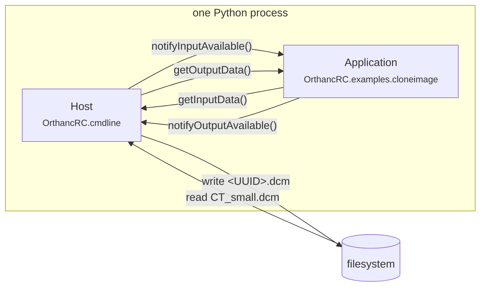
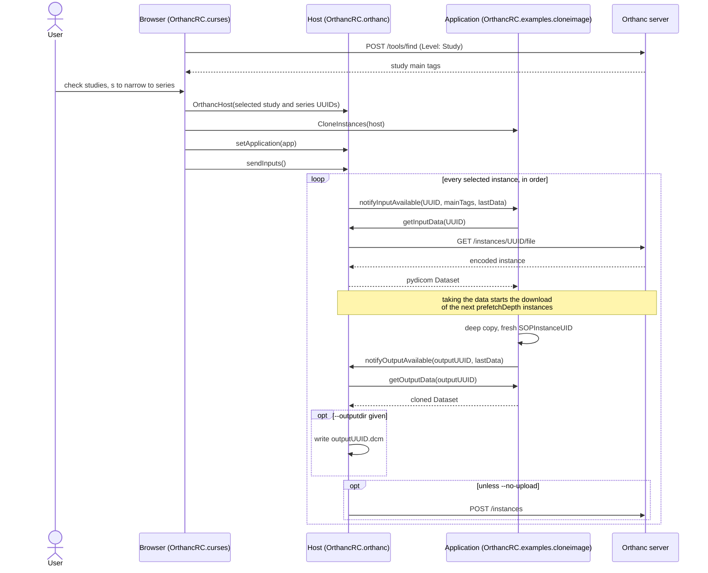

# Python Application Hosting

## Introduction

PS 3.19 describes the separation between host and application; see
https://dicom.nema.org/Dicom/2011/11_19pu.pdf. The standard defines Application
and Host communication through SOAP calls, but that is overkill for most
implementations because everything is Python.

## Installing

The project is a standard `src`-layout package built with setuptools. From the
root of a checkout:

```
python3 -m pip install -e .
```

That installs the framework and its only hard requirement, `pydicom`, which is
enough to write and test an Application against a host you supply yourself.

The Orthanc-backed host, the curses study browser and the example Applications
need `pyorthanc` as well, which lives behind the `orthanc` extra:

```
python3 -m pip install -e '.[orthanc]'
```

`-e` installs in editable mode, so edits under `src/OrthancRC` take effect
without reinstalling; drop it for an ordinary install. To build a wheel and
source distribution instead, use `python3 -m build`.

Installing puts three commands on the path:

| Command | Module | Extra |
| --- | --- | --- |
| `orthancrc-cmdline` | `OrthancRC.cmdline.filelist` | none |
| `orthancrc-browser` | `OrthancRC.curses.browser` | `orthanc` |
| `orthancrc-download` | `OrthancRC.examples.download.cli` | `orthanc` |

Similar projects include https://github.com/Ch00k/orthanc-cli.

### Requirements

All requirements are declared in `pyproject.toml`: Python 3.10+, `pydicom>=3.0`,
and `pyorthanc>=1.20` for the `orthanc` extra. `requirements.txt` and `setup.py`
are thin shims that defer to it.

## Python modules

This implementation expects that the end user starts the Python host process.
Python applications are loaded at runtime into the virtual environment of the
Python host process. There will need to be configuration options which define
the modules to be dynamically loaded at runtime. Each application module will
need to have the static fields `__version__`, `__icon__` and `__description__`.

The `__init__` method of an application module should have a single argument
containing a clone of the host interface object.

## DICOM objects

PS 3.19 allows native objects to be any kind of object, but for our purposes
they are DICOM objects. Native objects have descriptors and are identified by
UUIDs, so Orthanc UUIDs are a perfect fit. Object descriptors also carry a SOP
class, which this interface extends with the Orthanc main tags.

## Transferring data

In PS 3.19, transferring data is a two-step process which is performed at the
instance level. This is because, for large data sets, fetching data cannot
happen on the UI thread. It also allows a data selector to be used before data
is transferred or objects are loaded into memory.

This interface simplifies it to:

1. Host calls `Application.notifyInputAvailable(UUID, mainTags, lastData)`
2. Application calls `Host.getInputData(UUID)`, returning a pydicom object

When returning data to the Host:

1. Application calls `Host.notifyOutputAvailable(UUID, lastData)`
2. Host calls `Application.getOutputData(UUID)`, returning a pydicom object

The `mainTags` for an instance are defined by Orthanc and should include tags
from the Patient, Study, Series and Instance levels.

Some modules such as `OrthancRC.examples.download` use a separate transfer
thread to improve transfer speed.

## Application state

Every application has a state and a status. When the state changes it notifies
the host via the `Host.notifyStateChanged` method. Sometimes a message is passed
prior to a state change; this can be done through the
`Host.notifyStatus(value, text)` method.

- State values are `IDLE`, `INPROGRESS`, `COMPLETED`, `SUSPENDED`, `CANCELED`
  and `EXIT`.
- Status values are `INFORMATION`, `ERROR`, `WARNING` and `FATALERROR`.

## Windowing system

Some additional helper functions are defined in the XIP implementation of
PS 3.19. To match it, this interface includes the following functions:

- `Application.bringApplicationToFront()`
- `Host.getAvailableScreen()`
- `Host.getTmpDir()`
- `Host.generateUID()`

## Writing an Application

An Application is a subclass of `OrthancRC.base.Application`, which is an ABC
with four abstract methods, so all four have to be defined:

```python
from OrthancRC.base import Application, Host
from OrthancRC.enums import State
from pydicom.dataset import Dataset


class MyNewInstance(Application):
    """One line saying what this Application does."""

    __version__ = 1.0
    __description__ = "One line saying what this Application does."

    def __init__(self, host: Host) -> None:
        self._host = host
        self._outputs: dict[str, Dataset] = {}
        self._host.notifyStateChanged(State.IDLE)

    def notifyInputAvailable(self, instanceUUID: str, mainTags: dict[str, object],
                             lastData: bool) -> bool:
        ds = self._host.getInputData(instanceUUID)   # only if the tags interest you
        ...                                          # the processing itself
        self._outputs[outputUUID] = result
        self._host.notifyOutputAvailable(outputUUID, lastData)
        if lastData:
            self._host.notifyStateChanged(State.COMPLETED)
        return True

    def getOutputData(self, instanceUUID: str) -> Dataset:
        return self._outputs.get(instanceUUID, Dataset())

    def bringApplicationToFront(self) -> bool:
        return False    # headless: nothing to raise
```

`__init__` takes the Host and nothing else, because that is the signature every
front end constructs against: `--module` imports the named module, finds the
one concrete `Application` subclass in it, and calls `ApplicationClass(host)`.
Configuration of its own therefore has to arrive some other way -- the download
example parses its own command line before the Host is built.

`getOutputData()` is called from inside the `notifyOutputAvailable()` that
announced the output, and never after that call returns, so an Application may
build output on demand and drop it as soon as the call is over. Nothing obliges
an Application to produce output at all.

`OrthancRC.examples.cloneimage` is this skeleton filled in and is about as small
as a working Application gets.

## Example reference implementation

Command line:

```
cd src
python3 -m OrthancRC.cmdline --input ../tests/CT_small.dcm --module OrthancRC.examples.cloneimage
```

The Host and the Application are two objects in that one Python process,
calling each other's methods directly. Only the Host touches the filesystem:



## Orthanc study browser

Search an Orthanc server and pick studies in a curses list. Without `--module`
it only prints (and optionally saves) the checked study UUIDs:

```
python3 -m OrthancRC.curses --orthanc-url http://localhost:8042 \
    --search-patient-surname doe --save-selection selection.json
```

With `--module` the selection is handed straight to an Application: an
`OrthancHost` is built over the checked studies and the Application subclass
found in that module is loaded, wired to the host, and fed every instance of
every selected study. Output datasets are uploaded back into Orthanc unless
`--no-upload` is given, and `--outputdir` also writes them to disk.
`--tmpdir` puts the host's temporary files in a directory of your choosing
rather than a fresh system temp directory.

```
python3 -m OrthancRC.curses --module OrthancRC.examples.cloneimage \
    --outputdir ./out --no-upload
```

The module is loaded before the search runs, so a bad `--module` fails
immediately rather than after studies have been selected.

### How a run fits together

The browser, the Host and the Application are three separate things: the
browser only picks studies, the Host is the only one that talks to Orthanc, and
the Application never learns where its data came from.



`--stage` slots a `StagingHost` between the Application and the two sinks at the
bottom of that loop: it still takes the output inside `getOutputData()`, but
holds it until the review table is confirmed and only then calls `storeOutput()`
for the series that were accepted.

### Picking series

`s` opens a second picker that lists the series of every checked study in one
list, so that a study can be narrowed to some of its series. ENTER keeps the
sub-selection and confirms the browse; q or ESC discards the sub-selection but
not the browse.

### The selection file

Beyond `criteria` and `study_uids`, the file `--save-selection` writes has two
optional keys, `selection_level` and `series_uids`. A file written before those
existed still loads and still means what it always meant:

```json
{
  "criteria": { "...": null },
  "selection_level": "series",
  "study_uids": ["<study UUID>"],
  "series_uids": { "<study UUID>": ["<series UUID>"] }
}
```

The selection refers to objects by their Orthanc identifiers rather than DICOM
UIDs. An Orthanc identifier is a SHA-1 of the DICOM identity down to that level
-- `patientID|studyUID` for a study, `patientID|studyUID|seriesUID` for a series
-- which is Orthanc's own scheme.

Loading a file rejects:

- An entry that isn't shaped like an Orthanc identifier (five groups of eight
  lowercase hex digits), such as a DICOM UID.
- An entry listed twice.
- A criterion that isn't one of the `--search-*` fields.
- A criterion value that is neither a string nor null.

Saving checks the file the same way first and writes nothing if it would be
refused, so a saved file can always be loaded again.

`--restore-selection` strictly restores what was selected in the UI, so you must
give the same search criteria that were used to save the selection. The program
exits non-zero if the file cannot be read, if the criteria differ from the saved
ones, if a saved study is no longer among those the search matches, or if a
saved series is no longer held by its study. A study or series that has appeared
since the file was saved is not an error; it is simply not part of the restored
selection.

The strictness is deliberate. The selection file is the simplest form of
inter-process communication there is: a silently degraded selection is a
corrupted one, and the sender would never find out that half of it was dropped.

A run exits non-zero if the host reported an `ERROR` at any point, even when the
Application accepted every input. That covers a study that couldn't be read, a
failed download and a failed upload.

### Reviewing output before it is written: `--stage`

`--stage` holds the Application's output back until a table of the output
series it produced has been confirmed:

```
python3 -m OrthancRC.curses --module OrthancRC.examples.cloneimage \
    --stage --outputdir ./out
```

Each series is accepted or rejected on its own, and only the accepted ones are
written to `--outputdir` and uploaded to Orthanc. There is no cancel on that
screen, because the run is already over.

Encoded output is kept in memory up to `--output-cache` (a byte count with an
optional `K`/`M`/`G` suffix, default `128M`). Anything beyond that is spilled
to files in the host's temporary directory, which are deleted at the end of the
review whether their series was accepted or rejected.

### Prefetching input

Instances are downloaded ahead of the Application on a small thread pool, so
that the next one is usually already in hand when it is asked for.
`OrthancHost(..., prefetchDepth=N)` sets how many run ahead -- 2 by default;
`0` waits for each download at the moment it is asked for. The pool never has
more than four workers; a deeper window simply queues.

The window follows the Application's claims, not the order inputs are offered
in: an Application that filters on main tags -- as the download example does --
never asks for the data of most instances, and fetching those anyway would pull
the whole selection over just to throw it away.

## Download example application

An example Application with its own command line. It takes a study selection
saved earlier by the browser, watches the main tags the host offers for each
instance, and downloads only the series matching every criterion given:
`--match-modality` (exact, case-insensitive), `--match-series-description`
(substring, case-insensitive) and `--match-series-instance-uid` (exact). A
criterion left unset matches every series, so with none of them the whole
selection is downloaded into `--target-folder`:

```
python3 -m OrthancRC.examples.download \
    --from-selection-file selection.json \
    --match-modality CT --match-series-description head \
    --target-folder ./series
```

`--match-series-instance-uid` picks out one known series by its
SeriesInstanceUID, rather than describing it:

```
python3 -m OrthancRC.examples.download \
    --from-selection-file selection.json \
    --match-series-instance-uid 1.2.840.113619.2.55.3.604688.1 \
    --target-folder ./series
```

The instances of the matching series are written straight into the target
folder as `<SOPInstanceUID>.dcm`. If more than one series matches, the second
goes to `<target-folder>-1`, the third to `<target-folder>-2`, and so on.
Instances of non-matching series are filtered out on their main tags, so they
are never pulled from Orthanc.

Existing files are never overwritten. An instance whose file is already there
counts as failed and is reported, and a folder that isn't empty gets a warning
before anything is added to it.

The selection is restored strictly, as the browser restores one. If a saved
study can't be read, or a saved series has gone, the run stops before anything
is downloaded. Any error reported during the run gives a non-zero exit.

While it works, the download reports how far it has got on standard error: a bar
rewritten in place on a terminal, a line every 10% anywhere else. The rate counts
only the bytes of the instances actually downloaded:

```
downloaded 42 instance(s) in 2 series into ./series, skipped 58, failed 0, at 3.1 MiB/s
```

This can be turned off with `--no-progress`, which suppresses the running report
but not the closing summary.

This application can equally be driven from the browser with
`--module OrthancRC.examples.download`, which then downloads every selected
instance into the host's temporary directory.

## Series clone example application

`OrthancRC.examples.cloneseries` clones whole series rather than single
instances. Where `OrthancRC.examples.cloneimage` gives each copy a fresh
SOPInstanceUID and leaves it in its original series, this one moves the copies
into a series of their own.

It has its own command line, built on `OrthancRC.cmdline`: it accepts the same
`--input`, `--inputlist`, `--outputdir` and `--tmpdir` options, and adds
`--suffix`:

```
python3 -m OrthancRC.examples.cloneseries --input ../tests/CT_small.dcm \
    --outputdir ./out --suffix " RECON"
```

You can also load it with `--module`, from the command-line host or the
browser. That always uses the default suffix, because `--module` can only pass
the Application its Host:

```
python3 -m OrthancRC.cmdline --input ../tests/CT_small.dcm --module OrthancRC.examples.cloneseries
python3 -m OrthancRC.curses --module OrthancRC.examples.cloneseries --stage
```

Each run draws new UIDs, so cloning the same series twice gives two separate
series.

## Testing

The tests exercise the Orthanc host and the example Applications, so they need
the `orthanc` extra installed (see [Installing](#installing)):

```
python3 -m pip install -e '.[orthanc]'
python3 -m unittest discover -s tests -t tests
```
