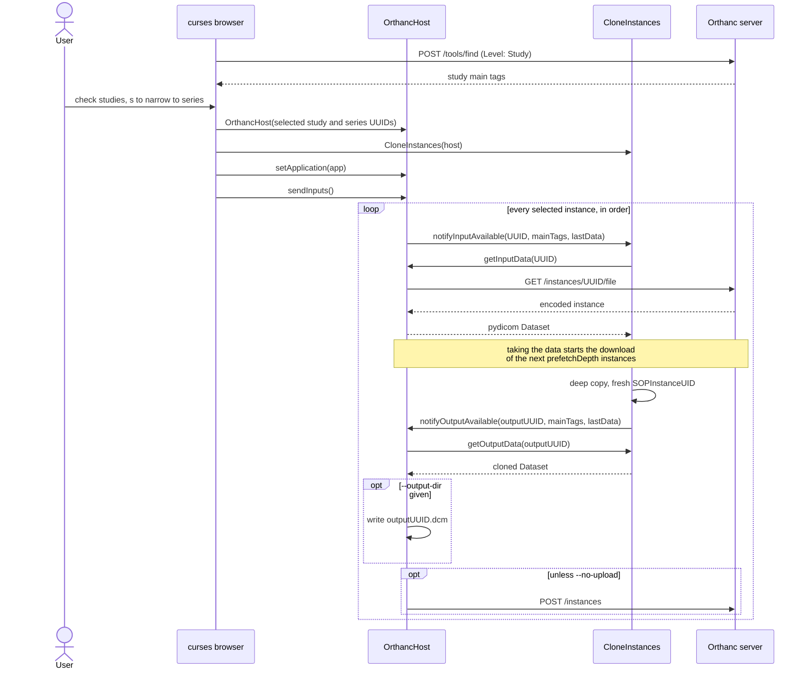

# Python Application Hosting

## Introduction

PS 3.19 describes the separation between host and application; see
https://dicom.nema.org/Dicom/2011/11_19pu.pdf. The standard defines Application
and Host communication through SOAP calls, but that is overkill for most
implementations because everything is Python.

## Python modules

This implementation expects that the end user starts the Python host process.
Python applications are loaded at runtime into the virtual environment of the
Python host process. There will need to be configuration options which define
the modules to be dynamically loaded at runtime. Each application module will
need to have the static fields `__version__`, `__icon__` and `__description__`.

The `__init__` method of an application module should have a single argument
containing a clone of the host interface object.

## DICOM objects

Native objects in PS 3.19 were designed in the standard to be any object, but
for our purposes they are DICOM objects. Native objects have descriptors, and
conveniently they are identified by UUIDs, so Orthanc UUIDs are a perfect fit.
Object descriptions also have a SOP class, but I have expanded this to include
Orthanc main tags.

## Transferring data

In PS 3.19, transferring data is a two-step process which is performed at the
instance level. The reason for this is that for large data sets, getting data
cannot happen on the UI thread. Also, it permits the use of a data selector
before transferring data or loading objects into memory.

I've simplified it to:

1. Host calls `Application.notifyInputAvailable(UUID, mainTags)`
2. Application calls `Host.getInputData(UUID)`, returning a pydicom object

When returning data to the Host:

1. Application calls `Host.notifyOutputAvailable(UUID, mainTags)`
2. Host calls `Application.getOutputData(UUID)`, returning a pydicom object

mainTags for instances are defined in Orthanc. I have included all main tags
from the Patient, Study, Series and Instance levels.

Some modules such as `OrthancRC.examples.download` use a separate transfer
thread to improve transfer speed.

## Application state

Every application has a state and a status. When the state changes it notifies
the host via the `Host.notifyStateChanged` method. Sometimes a message is passed
prior to a state change; this can be done through the
`Host.notifyStatus(value, text)` method.

- State values can be IDLE, INPROGRESS, COMPLETED, SUSPENDED, CANCELED, EXIT
- Status values can be INFORMATION, ERROR, WARNING, FATALERROR

## Windowing system

Some additional helper functions are defined in the XIP implementation of
PS 3.19. I have included the following functions:

- `Application.bringApplicationToFront()`
- `Host.getAvailableScreen()`
- `Host.getTmpDir()`
- `Host.generateUID()`

## Example reference implementation

Command line:

```
cd src
python3.13 -m OrthancRC.cmdline --input ../tests/CT_small.dcm --module OrthancRC.examples.clone
```

## Orthanc study browser

Search an Orthanc server and pick studies in a curses list. Without `--module`
it only prints (and optionally saves) the checked study UUIDs:

```
python3.13 -m OrthancRC.curses --orthanc-url http://localhost:8042 \
    --search-patient-surname doe --save-selection selection.json
```

With `--module` the selection is handed straight to an Application: an
`OrthancHost` is built over the checked studies and the Application subclass
found in that module is loaded, wired to the host, and fed every instance of
every selected study. Output datasets are uploaded back into Orthanc unless
`--no-upload` is given, and `--output-dir` also writes them to disk.
`--tmp-dir` puts the host's temporary files somewhere chosen rather than in a
fresh system temp directory.

```
python3.13 -m OrthancRC.curses --module OrthancRC.examples.clone \
    --output-dir ./out --no-upload
```

The module is loaded before the search runs, so a bad `--module` fails
immediately rather than after studies have been selected.

### How a run fits together

The browser, the Host and the Application are three separate things: the
browser only picks studies, the Host is the only one that talks to Orthanc, and
the Application never learns where its data came from.



`--stage` slots a `StagingHost` between the Application and the two sinks at the
bottom of that loop: it still takes the output inside `getOutputData()`, but
holds it until the review table is confirmed and only then calls `storeOutput()`
for the series that were accepted.

### Picking series

`s` opens a second picker over every study that is checked, listing all their
series as one list, so that a study can be narrowed to some of them. ENTER keeps
the sub-selection and confirms the browse; ESC exits the selection.

### The selection file

Beyond `criteria` and `study_uids`, the file `--save-selection` writes has two
optional keys, `selection_level` and `series_uids`. A file written before those
existed still loads and still means what it always meant:

```json
{
  "criteria": { "...": null },
  "selection_level": "series",
  "study_uids": ["<study UUID>"],
  "series_uids": { "<study UUID>": ["<series UUID>"] }
}
```

The selection refers to objects by their Orthanc identifiers rather than DICOM
UIDs. An Orthanc identifier is a SHA-1 of the DICOM identity down to that level
-- `patientID|studyUID` for a study, `patientID|studyUID|seriesUID` for a series
-- which is Orthanc's own scheme.

`--restore-selection` strictly restores what was selected in the UI, so you must
give the same search criteria that was used to save the selection. The program
exits non-zero if the file cannot be read, if the criteria differ from the saved
ones, if a saved study is no longer among those the search matches, or if a
saved series is no longer held by its study. A study or series that has appeared
since the file was saved is not an error; it is simply not part of the restored
selection.

The selection file is the message of the simplest inter-process communication
there is: a silently degraded selection is a corrupted one, and the sender would
never find out that half of it was dropped.

### Reviewing output before it is written: `--stage`

`--stage` holds the Application's output back until a table of the output
series it produced has been confirmed:

```
python3.13 -m OrthancRC.curses --module OrthancRC.examples.clone \
    --stage --output-dir ./out
```

The table is one row per output series with a count of the output instances in
it -- which is not the size of the input series, since an Application may emit
one output per input, or fewer, or more -- and every row starts accepted. So
`--stage` is a review step rather than an opt-in: confirming the table
untouched does exactly what the same run without `--stage` would have done,
and rejecting is the action. There is no cancel on that screen, because the
run is already over and there would be nothing to cancel to; the ways out are
ENTER and an explicit `n`. A series that is rejected is never written and
never uploaded, and `getOutputData()` is never called for it.

The Application sees no change at all. Its `getOutputData()` is called once,
synchronously, from inside its own `notifyOutputAvailable()`, exactly where it
is called without `--stage`, so an Application that builds its output on
demand and frees it when the call returns works staged too. That is deliberate
rather than incidental: this interface has no `releaseData()`, so nothing
would tell an Application when it may free an output the Host asked it to
keep, and a Host that deferred the call until after the run would be asking
for data every reasonable Application has already dropped. The Host therefore
takes the output while the call is in its hands and takes responsibility for
it afterwards.

Which means holding it. Encoded output is kept in memory up to
`--output-cache` (a byte count with an optional `K`/`M`/`G` suffix, default
`128M`) and written to a spill file in the host's temporary directory past
that, deleted at the end of the review whether its series was accepted or
rejected. 128 MB is roughly 250 512x512 16-bit CT slices, two or three typical
series; a large single frame -- mammography, whole-slide -- spills almost at
once, which is the right outcome for output that should not be accumulating in
a Python process. `--output-cache 0` spills everything. What was held and what
was spilled is reported at the end of a run, since that is the only way to
find out the number was too low for the work. It is a ceiling on output held,
on top of the `prefetchDepth` decoded input datasets the prefetch window may
hold.

None of that lives in the terminal front end. `StagingHost` wraps an
`OrthancHost` and intercepts exactly one call, forwarding everything else, so
it has one tmp dir and one message list between the two; `curses` contributes
the y/n screen and nothing more.

### Prefetching input

Taking an instance's data starts the download of the next few on a small
thread pool, so the following `getInputData()` usually only waits for a request
that is already in flight. The window is `OrthancHost(..., prefetchDepth=2)`
instances deep; `prefetchDepth=0` turns it off and fetches each instance at the
moment it is asked for.

It is worth having: downloading a selection over a local network measured
about 11 MB/s with `prefetchDepth=0` and about 22 MB/s at the default depth of
2, as reported by the download example's own rate (see below). Serial fetching
spends most of a run waiting for the server to answer, and that is the time the
pool fills.

Prefetching follows what the Application takes, not where `sendInputs()` has
got to, so it costs nothing for an Application that filters on main tags and
asks for few instances, and it works just as well for one that reads every main
tag first and only asks for the data afterwards -- from the last input, or once
the run is over. In that last case call `host.close()` when done, to stop the
pool `sendInputs()` is no longer around to close.

### Using the Host directly

The Host itself is not part of the terminal front end: `OrthancHost` lives in
`OrthancRC.orthanc` and knows only a list of study UUIDs -- and, optionally,
which series to take from each -- so anything can pick them.
`OrthancHost.fromSelectionFile()` builds one from a saved selection, and
`OrthancRC.curses.browser.host_from_browser()` is the whole picker as a single
call for a caller that wants a ready-made Host rather than a command line.

## Download example application

An example Application with its own command line. It takes a study selection
saved earlier by the browser, watches the main tags the host offers for each
instance, and downloads only the series matching every criterion given:
`--match-modality` (exact, case-insensitive), `--match-series-description`
(substring, case-insensitive) and `--match-series-instance-uid` (exact). A
criterion left unset matches every series, so with none of them the whole
selection is downloaded into `--target-folder`:

```
python3.13 -m OrthancRC.examples.download \
    --from-selection-file selection.json \
    --match-modality CT --match-series-description head \
    --target-folder ./series
```

`--match-series-instance-uid` picks out one known series by its
SeriesInstanceUID, rather than describing it:

```
python3.13 -m OrthancRC.examples.download \
    --from-selection-file selection.json \
    --match-series-instance-uid 1.2.840.113619.2.55.3.604688.1 \
    --target-folder ./series
```

The instances of the matching series are written straight into the target
folder as `<SOPInstanceUID>.dcm`. If more than one series matches, the second
goes to `<target-folder>-1`, the third to `<target-folder>-2`, and so on.
Instances of non-matching series are filtered so they are never pulled from
Orthanc.

While it works, the download reports how far it has got on standard error: a bar
rewritten in place on a terminal, a line every 10% anywhere else. The rate counts
only the bytes of the instances actually downloaded:

```
downloaded 42 instance(s) in 2 series into ./series, skipped 58, failed 0, at 3.1 MiB/s
```

This can be turned off with `--no-progress`, which suppresses the running report
but not the closing summary.

This application can equally be driven from the browser with
`--module OrthancRC.examples.download`, which then downloads every selected
instance into the host's temporary directory.

## Testing

```
python3.13 -m unittest discover -s tests -t tests
```
